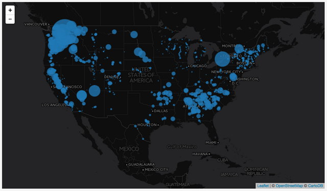
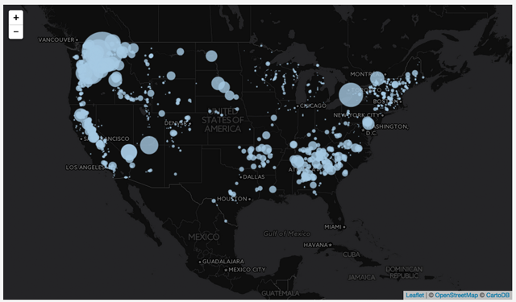
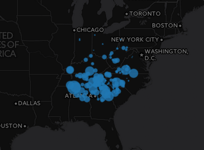
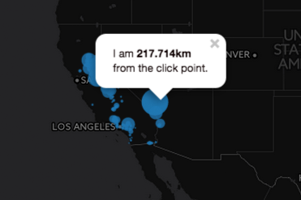
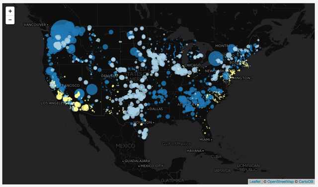

#Module 12: Leaflet's GeoJson Methods and Layer Controls

##Overview

This lab does the following:

* reviews the creation of Leaflet L.GeoJson layers 
* shows how to set both universal styles and layer specific styles using the `L.GeoJson` style option
* shows how to invoke Leaflet methods on entire layer groups and individual layers after creation using the `eachLayer` method
* introduces the concept of code iguanas, outlines how it is a silly idea but procedures to make mention of the idea throughout the lab
* suggests two solutions for creating a bi-variate map
* shows how to create multiple Leaflet GeoJson layers and add them to a Leaflet layer control
* introduces some advanced techniques for refactoring code

###Working files

You should use the index.html file located in the session-12/lab/ directory from the course Github repository. Remember to sync your local version of the course repository with the online version first.

##Leaflet GeoJson Review and Recap

In the previous module we learned how to load GeoJSON data, stored as a JavaScript object and saved within an external file, into our script. We then used the Leaflet *L.geoJson()* method to draw these point-level data to a Leaflet GeoJson layer, which we then added to our map. We then used *L.geoJson()*'s options:

* *pointToLayer* to convert default Leaflet markers to *circleMarkers*, 
* *filter* to show only features meeting specific criteria, and 
* *onEachFeature* to bind Leaflet *Popup* objects to the features and attached additional event listeners such as *mouseover* and *mouseout*

You may find it useful to review the solutions for Map 2 (either now posted or available in a day or two).

A key part of the script was using a custom JavaScript function (which you as the coder had to write) to determine the radius for each of the proportional symbols we created. The following code exemplifies the creation of a Leaflet GeoJson layer comprising hydroelectric plants. The `getRadius()` function call passes the value of each `"Hydro"` fuel source into the `getRadius()` function, which returns a specific numeric value that is then assigned as the value of the `radius` property of the `L.circleMarker`'s style options. 

Whew! **Iguanarific**

```javascript
    L.geoJson(plants, {
        pointToLayer: function(feature,latlng) {
            return L.circleMarker(latlng, {
                color: '#1f78b4',
                fillColor: '#1f78b4',
                weight: 1,
                stroke: 1,
                fillOpacity: .8
                radius: getRadius(feature.properties.fuel_source["Hydro"])
            });
        },
        filter: function(feature) {
            if(feature.properties.fuel_source["Hydro"]) {
                return feature;
            }
        } 
    }).addTo(map);
        
    function getRadius(val) {
        var radius = Math.sqrt(val/Math.PI);
        return radius * .8;   
    }
```

Thus we dynamically create a proportional symbol map that looks like this:



**Figure 12-01: Proportional Symbol Map of Hydro Power**

We can also use another Leaflet *L.geoJson* option, the *style* option, to apply the same path styles to our *CircleMarker* layers as we create them. The following code does the exact same thing but through different means. And yes, you need to get used to the idea that there are many ways to skin an iguana! Although that is a truly horrific analogy for iguana lovers. A much better one is, there are many ways to love and care for an iguana.

In any case the code using the *style* option below produces a map exactly the same as the previous one.

```javascript
    L.geoJson(plants, {
        pointToLayer: function(feature,latlng) {
            return L.circleMarker(latlng);
        },
        filter: function(feature) {
            if(feature.properties.fuel_source["Hydro"]) {
                return feature;
            }
        },
        style: function(feature) {
            return {
                color: '#1f78b4',
                fillColor: '#1f78b4',
                weight: 1,
                stroke: 1,
                fillOpacity: .8
                radius: getRadius(feature.properties.fuel_source["Hydro"])
            } 
        } 
    }).addTo(map);
```
Drawing our proportional symbol map in this way is great, but it's a bit of a one shot deal. Imagine for a moment that a virtual species of iguanas inhabit your code and are responsible for making sure stuff gets done. Sort of like software bugs but green, helpful and with soulful eyes. In this case, once this code runs, our map is drawn and all the code iguanas kick back for tequila and tacos. 

But what if we want to access and manipulate our features (e.g., proportional symbols) later on, such as through user interaction? Great for users since they have more options, perhaps less great for the code iguanas since they are still on the job. And btw, as much as you may wish to do so, you can't really blame the code iguanas for errors in your code. Why? you ask. After all they're the ones swilling tequila and gorging on tacos. Well, the reason is simple, code iguanas are what we like to refer to as *imaginary* also known as *fanciful*, *fictional* and *unreal*. 

This is where GeoJson's methods come into play. 

##Using Leaflet Methods to Access and Modify Layers After Creation

The power of web mapping lies not just in our ability to dynamically create data-driven maps, which admittedly is pretty cool! Rather, it lies in the potential to dynamically change the map once it has been drawn. Such *event-driven* changes may add or remove data layers from the map, filter the data in some way, update a data layer, or re-symbolize the data from circles to something really useful like proportionally sized iguanas. Sometimes these event-driven changes occur automatically (such as a map that is continually updated with real-time data). Often, however, we're concerned with user-generated change: interaction with the map.

###Turning a GeoJson layer into a variable
To access the Leaflet GeoJson layer we create, we first need to store a reference to it. This is as easy as creating a variable and assigning it to our *L.geoJson()* method call. Simply by adding the `var hydroLayer =` we can access they layer we've already been using in cool ways.

```javascript
    var hydroLayer = L.geoJson(plants, {
        pointToLayer: function(feature,latlng) {
            return L.circleMarker(latlng);
        }, ...
```

###Applying methods to the GeoJson layer variable
Once we create this `hydroLayer` variable (as a reference to our GeoJson layer, i.e., our hydro proportional symbols), we can then apply the methods available to a GeoJson layer to retrieve information from the features or modify the layers from which they're drawn.

For example, after drawing all our *circleMarkers* as the blue (hex color `#1f78b4`) above, later in the script we could change their color with a `.setStyle()` method. But wait! Because you're always referencing the Leaflet API [http://leafletjs.com/reference.html#geojson](http://leafletjs.com/reference.html#geojson), you may be confused why there is no `.setStyle()` method for *L.GeoJson*. However, you then remember that Leaflet's *GeoJson* layer extends *L.FeatureGroup*, which does have a *setStyle()* method [http://leafletjs.com/reference.html#featuregroup-setstyle](http://leafletjs.com/reference.html#featuregroup-setstyle).

This means that the code below -- the bit at the bottom -- is affecting the geoJson layer.

```javascript
    var hydroLayer = L.geoJson(plants, {
        pointToLayer: function(feature,latlng) {
            return L.circleMarker(latlng, commonStyles);
        },
        filter: function(feature) {
            if(feature.properties.fuel_source["Hydro"]) {
                return feature;
            }
        },
        style: function(feature) {
            return {
                color: '#1f78b4',
                fillColor: '#1f78b4',
                radius: getRadius(feature.properties.fuel_source["Hydro"])
            } 
        } 
    }).addTo(map);

    hydroLayer.setStyle({
        color: '#a5c9e2',
        fillColor: '#a5c9e2'
    });
```

The result then is that the `setStyle()` method has uniformly changed the style options of the elements contained within the layer referenced by the `hydroLayer` variable, turning dark blue circles into light blue circles:



**Figure 12-02: Changing a GeoJson layer with the setStyle method**

Ok, this is a fairly trivial example, and note that it isn't event-driven. The code iguanas have already knocked and are at Tito Tequila Taqueria, chillin'. This is because the script just runs and then changes the previously set *Path* options to different values.  But, it demonstrates how we can use a method to change an entire set of features contained within a GeoJson layer. What about accessing and modifying the individual elements within a GeoJson layer?

###Accessing individual elements in a GeoJson layer
The *GeoJson* layer extends *L.FeatureGroup*, which extends *L.LayerGroup*, which has all sorts of fun methods for layer manipulation. One of these is the *.eachLayer()* method [http://leafletjs.com/reference.html#layergroup-eachlayer](http://leafletjs.com/reference.html#layergroup-eachlayer) which is an important method in Leaflet for event-driven change of our data-driven symbology features. Let's first walk through how it works before considering a practical example.

We'll start with the GeoJson layer of hydropower from above which we are now referencing with the `hydroLayer` variable. We call each layer using the *.eachLayer()* method on this variable, which allows us to access every layer (i.e., individual *circleMarker*) within the GeoJson layer.  Wow, we used the word layer a lot in that last sentence. But just in case you didn't get enough, here's some more. Layer, layer, lAyer, laYER, layeR .... and so on.

```javascript
    var hydroLayer = L.geoJson(plants, {
        pointToLayer: function(feature,latlng) {
            return L.circleMarker(latlng);
        },
        filter: function(feature) {
            if(feature.properties.fuel_source["Hydro"]) {
                return feature;
            }
        },
        style: function(feature) {
            return {
                color: '#1f78b4',
                fillColor: '#1f78b4',
                weight: 1,
                stroke: 1,
                fillOpacity: .8
                radius: getRadius(feature.properties.fuel_source["Hydro"])
            } 
        } 
    }).addTo(map);

    hydroLayer.eachLayer(function(layer) {
        // code goes here
        console.log(layer);
    });
```

Pay careful attention to the way the *.eachLayer()* method is written. You can see that it passes one argument, which is itself a function. This is an anonymous function, meaning that it has no name and can not be called later in the script and you've seen this kind of function before. Remember that this function is invoked immediately for each layer contained within the `hydroLayer` GeoJson layer. When this functions passes its argument -- the layer that the method is currently cycling through -- we are able to access this layer within the anonymous function's body, in this example through a console log statement.

Let's carefully example in the output in the console. We see that it has logged each layer within our `hydroLayer` GeoJson layer:


**Figure 12-03: Console output for logging each layer of our GeoJson layer**

While many of the properties of this layer output are not of immediate interest to us, take a look at one in particular, the `feature` option:


**Figure 12-04: The feature option of each layer**

You should recognize this as the feature data from our GeoJSON data from which we drew our Leaflet GeoJson layer. Leaflet, upon creating these SVG elements (*circleMarkers*), has stored the feature data for each within each layer. So we can access this information in addition to accessing and modifying an individual layer. Let's consider a specific practical example now.

Let's say that, upon clicking on the map, we want to only see the proportional symbols within 500 km of the click point. To do so, we'll use the Leaflet *.on()* method and attach it using dot notation to the `map` variable. This *.on()* method is listening for a `'click'` event. This is the thing that really annoys the code iguanas since they are stuck listening for a click, and you thought you had boring jobs.  So when a click occurs it immediately invokes an anonymous function, which passes a letter `e` as the argument. As demonstrated in previous labs, this `e` is a reference to the click event itself, and we can obtain the coordinates of this using `e.latlng`. 


```javascript
    var hydroLayer = L.geoJson(plants, {
        pointToLayer: function(feature,latlng) {
            return L.circleMarker(latlng);
        },
        filter: function(feature) {
            if(feature.properties.fuel_source["Hydro"]) {
                return feature;
            }
        },
        style: function(feature) {
            return {
                color: '#1f78b4',
                fillColor: '#1f78b4',
                weight: 1,
                stroke: 1,
                fillOpacity: .8
                radius: getRadius(feature.properties.fuel_source["Hydro"])
            } 
        } 
    }).addTo(map);

    map.on('click', function(e) {
        console.log(e.latlng)                   // access to the click coordinates
        hydroLayer.eachLayer(function(layer) {
            console.log(layer.getLatLng());     // access to the layer coordinates
        });
    });
```

Within the *.on()* method's callback, we are then invoking the *.eachLayer()* method on the `hydroLayer` variable, and thus iterating through all our hydro power proportional symbols. These are Leaflet *circleMarker* objects, remember, so we can obtain their coordinate position using the `getLatLng()` method.

With these two pieces of information, we can then use our now familiar `distanceTo()` method to calculate the distance between our click point and each GeoJson feature (i.e., each of our proportional symbol layers), and store this distance (in meters) as a variable.

```javascript
    map.on('click', function(e) {
        hydroLayer.eachLayer(function(layer) {
            var distance = e.latlng.distanceTo(layer.getLatLng());
            console.log(distance);     // distance in meters between click point
                                       // and each layer's centroid
        });
    });
```

Then, we can use a conditional statement to determine if each layer is located more than 500 km from our click point, in which case, we can invoke the `setStyle()` method on the layer to change the `stroke` and `fill` properties to false (thereby rendering the feature invisible). We could also change the style of layers within 500 km but we'll just send values of `true` so nothing will change for those layers.

```javascript
    map.on('click', function(e) {
        hydroLayer.eachLayer(function(layer) {
            var distance = e.latlng.distanceTo(layer.getLatLng())/1000; // distance as km
            
            if(distance > 500) {
                layer.setStyle({
                    stroke: false,
                    fill: false
                });  
            } else {
               layer.setStyle({
                    stroke: true,
                    fill: true  
               });  
            } 
        });
    });

```
The result of the code is below.



**Figure 12-05: Features beyond 500 km rendered invisible**

Subsequently clicking on the map will again iterate through all the features and reset their styles based upon their distance from the new click point. Man, those code iguanas are really getting a work out. We can additionally bind a Leaflet Popup to each layer and update it with newly generated information, such as its distance from the click point.

```javascript
    map.on('click', function(e) {
        hydroLayer.eachLayer(function(layer) {
            var distance = e.latlng.distanceTo(layer.getLatLng())/1000;

            if(distance > 500) {
                layer.setStyle({
                    stroke: false,
                    fill: false
                });  
            } else {
               layer.setStyle({
                    stroke: true,
                    fill: true  
               });  
               layer.bindPopup("I am <b>"+distance.toLocaleString()+ 
                               "km</b><br> from the click point.");
            } 
        });
    });
```

These small changes are really generating a lot of cool interactivity and useful information.



**Figure 12-06: Leaflet Popup dynamically updated with content**

##Creating a Bi-variate Map With Multiple GeoJson Layers

In Module 11 we saw to use our JavaScript code to access particular data attributes of our GeoJSON feature data, such as the amount of electric power produced from a plant or fuel source (a numerical or quantitative data level) or the type of fuel source (a nominal or categorical data level). Furthermore, we learned how to use the size of the *circlesMarkers* to encode the relative magnitudes of the power produced, as well as color various plants based upon their predominate fuel source.

While filtering the map to show a single fuel source is very useful (we can see the spatial distribution of that particular energy source, as well as the relative magnitudes of those plants), showing two fuel sources at once allows the map to convey even more information while allowing us to make comparisons between various fuel sources. More work for the code iguanas but so be it!

What we really want to do is create a bi-variate map, such as the one below, which allows us to compare hydro (colored in dark blue), wind (light blue), and solar (yellow) power:



**Figure 12-07: Bi-variate map showing hydro, wind, and solar power**

There are lots of ways to achieve this. For one, we could use conditional statements within the *onEachFeature* or *filter* options when we first run through our GeoJSON `plants` data with the *L.GeoJson()* method. If it's a hydro source, then we style it using one color, if coal another. We could also modify the size of the radius within these statements as well, and the conditional statement would look something like this:

```javascript
    onEachFeature: function(feature,layer) {
        if(feature.properties.source["Coal"]) {
            layer.setStyle({
                fillColor: 'red',
                radius: getRadius(feature.properties.source["Coal"])
            });
            layer.symbolColor = 'red';
        } else if(feature.properties.source["Hydro"]) {
            layer.setStyle({
                fillColor: 'blue',
                radius: getRadius(feature.properties.source["Hydro"])
            });  
            layer.symbolColor = 'blue';
        }
    }
```

###Dealing with "tricky" data in bivariate maps
This is a fine solution, though keep in mind that there may still be a design/development challenge with respect to this particular dataset in that some plants use two fuel sources (so how then would we represent a plant using coal and natural gas, if we wanted to compare these two fuel sources?).

One way to deal with multiple fuel sources is to simply create separate Leaflet GeoJson Layers. While this may appear redundant, it is effective. We'll address the redundancy of the written code later in the module. For now though, consider the following code which creates two separate GeoJson layers as an adequate solution:

```javascript
        var commonStyles = {
             weight: 1,
             stroke: 1,
             fillOpacity: .8
        }
        
        var hydroLayer = L.geoJson(plants, {
            pointToLayer: function(feature,latlng) {
                return L.circleMarker(latlng, commonStyles);
            },
            filter: function(feature) {
                if(feature.properties.fuel_source["Hydro"]) {
                    return feature;
                }
            },
            style: function(feature) {
                return {
                    color: '#1f78b4',
                    fillColor: '#1f78b4',
                    radius: getRadius(feature.properties.fuel_source["Hydro"])
                } 
            } 
        }).addTo(map);

        var windLayer = L.geoJson(plants, {
            pointToLayer: function(feature,latlng) {
                return L.circleMarker(latlng, commonStyles);
            },
            filter: function(feature) {
                if(feature.properties.fuel_source["Wind"]) {
                    return feature;
                }
            },
            style: function(feature) {
                return {
                    color: '#a6cee3',
                    fillColor: '#a6cee3',
                    radius: getRadius(feature.properties.fuel_source["Wind"])
                }
            }
        }).addTo(map);

```

This example demonstrates creating two GeoJson layers, assigning them to separate variables (`hydroLayer` and `windLayer`), and adding them to the map. Plants with both Hydro and Wind sources get added to bother layers. Notice how we first define an object named `commonStyles` and apply that to all the *L.circleMarker* layers. Then, within the *style*'s function, we apply specific styles to modify the appearance of those layers.

The `map.on('click' ...` functionality handling the appearance of layers within a certain distance could also be reproduced in the same way. Redundant code, yes, but works for now. Note that is often common to write more code than necessary when first getting a map going (sometimes referred to as "prototyping"). Later on, code can be cleaned up (or "refactored") to make it more efficient.

And efficient is good, mainly because it makes the maps react faster but also because it gives the code iguanas less work to do.

##Adding a Leaflet Layer Control Object

One advantage to creating separate Leaflet GeoJson layers is that we can use another handy piece of Leaflet's built-in functionality, the layers control [http://leafletjs.com/reference.html#control-layers](http://leafletjs.com/reference.html#control-layers). This control allows us the user to switch on and off various layers we've created. Leaflet even provides a default user interaction (UI) element for doing this:

Implementing this within Leaflet is very simple. Say I've created three Leaflet layers and referenced them with variables named `hydroLayer`, `windLayer`, and `solarLayer` (using the code from above). We then create an object whose properties use these variables as the value, while the property names are the text we wish to appear within the layer control. We've stored these properties within an object referenced with the variable `sourcesLayers`

```javascript
    var sourcesLayers = {
        "Hydro": hydroLayer,
        "Wind": windLayer,
        "Solar": solarLayer
    }
```

Then we invoke a `L.controls.layers()` method, passing three arguments into it. The first argument controls the basemap layers (i.e., the tiled basemap we add to the map at the beginning of our script and is really useful if you wanted to give the use the ability to switch between baselayers, i.e., you could create another object and pass it as this first argument. But for this example we'll just make it null. The second argument is the one we're really interested in here, as it references the `sourcesLayers` object we created. Finally, we can pass a third optional argument, in this case containing a property that keeps the layer control UI open instead of collapsing it. We then add the layer control to the map.

```javascript
    var sourcesLayers = {
        "Hydro": hydroLayer,
        "Wind": windLayer,
        "Solar": solarLayer
    }

    L.control.layers(null, sourcesLayers, { collapsed:false }).addTo(map);
```

The result is that the user can now toggle on and off the layers made available to the layer control. It probably also results in an unhappy code iguana hanging by the toggle and gazing wistfully at Tito's Taqueria. Or not, remember no matter how much we try to anthropomorphize them, code iguanas don't actually exist. At least not in javascript, perhaps in python, after all it is more *reptilian*.

Note that the property names within the `sourcesLayers` object can include HTML tags. So, for example, if we wanted to make our layer control labels the color of our respective fuel sources (acting as a minimal kind of legend), we could write the names like this:

```javascript
    var sourcesLayers = {
        "<b style='color:#1f78b4'>Hydro</b>": hydroLayer,
        "<b style='color:#a6cee3'>Wind</b>": windLayer,
        "<b style='color:#ffff99; text-shadow: 0px 0px 1px #333;'>Solar</b>": solarLayer
    }
```

The text for the labels has been wrapped in HTML `<b>` tags to make the text bold, and we've applied inline CSS style rules to color the text. We've also included a text-shadow property to make the light yellow color stand out against the white background.


**Figure 12-08: Leaflet layer control with Label text styled**

##Getting Advanced: Refactoring Your Code

To wrap up this module, let's go back and revisit that redundant code. Furthermore, the technique that follows is a common practice within code development and worth at least trying to get your head around. It can have big payoffs when you really get up to speed with coding and will have the code iguanas move faster than a barefoot jackrabbit on a hot greasy griddle in the middle of August!

Alright, for this exercise, assume we've written this rather redundant code, and we've gotten it to run successfully. Hooray!!

```javascript
    var commonStyles = {
         weight: 1,
         stroke: 1,
         fillOpacity: .8
    }
    
    var hydroLayer = L.geoJson(plants, {
        pointToLayer: function(feature,latlng) {
            return L.circleMarker(latlng, commonStyles);
        },
        filter: function(feature) {
            if(feature.properties.fuel_source["Hydro"]) {
                return feature;
            }
        },
        style: function(feature) {
            return {
                color: '#1f78b4',
                fillColor: '#1f78b4',
                radius: getRadius(feature.properties.fuel_source["Hydro"])
            } 
        } 
    }).addTo(map);

    var windLayer = L.geoJson(plants, {
        pointToLayer: function(feature,latlng) {
            return L.circleMarker(latlng, commonStyles);
        },
        filter: function(feature) {
            if(feature.properties.fuel_source["Wind"]) {
                return feature;
            }
        },
        style: function(feature) {
            return {
                color: '#a6cee3',
                fillColor: '#a6cee3',
                radius: getRadius(feature.properties.fuel_source["Wind"])
            }
        }
    }).addTo(map);
```

While there is nothing really wrong with this code, imagine if we wanted to make our map with all 13 of our fuel sources as separate Leaflet GeoJson layers. The repetition of the code would become very unwieldy which also increases the chance for errors. In addition, suppose we wanted to add an additional conditional statement within the *filter* option to filter out plants under a certain level of power production. We'd have to go edit every one of the 13 code blocks! That's even painful for code iguanas.

So, instead, we recognize where the redundant code is and think of ways to loop through it.

The trick to doing this is to recognize where the values will be different for each one. So, for this example, we see this part remains the same for each:

```javascript
    var hydroLayer = L.geoJson(plants, {
        pointToLayer: function(feature,latlng) {
            return L.circleMarker(latlng, commonStyles);
        },
```

Within the *filter option*, only the name of the fuel source will change, so in this case we're starting to think about substituting the hard-coded `"Hydro"` with a variable whose value will change as we loop through the entire strucutre:

```javascript
    filter: function(feature) {
        if(feature.properties.fuel_source[<variableName>]) {
            return feature;
        }
    },
```

Finally, we see the hexidecimal color values for each has been hard-coded, so we'll want to swap those out with variables, as well as the fuel source we're using to pass a value to the `getRadius()` function.

```javascript
        style: function(feature) {
            return {
                color: <variableName>,
                fillColor: <variableName>,
                radius: getRadius(feature.properties.fuel_source[<variableName>])
            }
        }
    }).addTo(map);
```

Okay, so we know that instead of repeating that same structure over and over again, we want to loop through it, substituting values for variable names upon each iteration. This is really similar to the simple for loops we've been using.

First, we'll create a JS object to hold the information we want to insert within the code. So for this example, we'll use our anticipated variable name for each Leaflet GeoJson layer as the property name, and then an object of the associated information for each layer. Eventually we'd include all 13 power types but to keep things simple we'll just show it for two.

```javascript
    var layerInfo = {
        hydroLayer: {source:"Hydro", color:'#1f78b4'}, 
        windLayer: {source:"Wind", color:'#a6cee3'}
    }
```
We're going to loop through this object called `layerInfo` but before we do (and this is a bit tricky to get your head around) we'll create an empty object `var geoJsonLayers = {}` to hold the variable names for each Leaflet GeoJson layer we'll be creating.

```javascript
    var layerInfo = {
        hydroLayer: {source:"Hydro", color:'#1f78b4'}, 
        windLayer: {source:"Wind", color:'#a6cee3'}
    }
        
    var geoJsonLayers = {};
```

Now we're ready to construct our looping structure. Because we're looping through a JS object `layerInfo`, and not an Array, we'll be using the `for(var name in object)` looping structure. You'll want to `console.log(layer, layerInfo[layer])` within this loop to understand how it is accessing the object property names and values. Essentially, with each iteration here, `layer` will be the property name (i.e., `"hydroLayer"`, `"windLayer"`) and `layerInfo[layer]` will be accessing the associated Array (i.e., `source:"Hydro", color:'#1f78b4'`)

The following code then achieves the same thing as repeating the structure to create the GeoJson layers:

```javascript
    for(var layer in layerInfo) {     
        geoJsonLayers[layer] = L.geoJson(plants, {
            pointToLayer: function(feature,latlng) {
                return L.circleMarker(latlng, commonStyles);
            },
            filter: function(feature) {
                if(feature.properties.fuel_source[layerInfo[layer].source]) {
                    return feature;
                }
            },
            style: function(feature) {
                return {
                    color: layerInfo[layer].color,
                    fillColor: layerInfo[layer].color,
                    radius: getRadius(feature.properties.fuel_source[layerInfo[layer].source])
                } 
            } 
        }).addTo(map);        
     }
```

Furthermore, we've dynamically created variable names for each GeoJson layer and stored them as property names with the `geoJsonLayers` object with the `geoJsonLayers[layer] = ...` statement. Therefore, we can still access those layers (and add them to our Leaflet layer control by writing `geoJsonLayers.hydroLayer` etc.

The full solution then looks like this:

```javascript
        var layerInfo = {
            hydroLayer: {source:"Hydro", color:'#1f78b4'}, 
            windLayer: {source:"Wind", color:'#a6cee3'}
        }
        var geoJsonLayers = {};
        
        for(var layer in layerInfo) {     
            geoJsonLayers[layer] = L.geoJson(plants, {
                pointToLayer: function(feature,latlng) {
                    return L.circleMarker(latlng, commonStyles);
                },
                filter: function(feature) {
                    if(feature.properties.fuel_source[layerInfo[layer].source]) {
                        return feature;
                    }
                },
                style: function(feature) {
                    return {
                        color: layerInfo[layer].color,
                        fillColor: layerInfo[layer].color,
                        radius: getRadius(feature.properties.fuel_source[layerInfo[layer].source])
                    } 
                } 
            }).addTo(map);        
         }
    
        function getRadius(val) {
            var radius = Math.sqrt(val/Math.PI);
            return radius * .8;   
        }
                
        var sourcesLabels = {
            "Hydro": geoJsonLayers.hydroLayer,
            "Wind": geoJsonLayers.windLayer
        }

        L.control.layers(null, sourcesLabels, { collapsed:false }).addTo(map);
```

Again, perhaps not immediately evident when only creating two layers, but certainly for many more the payoff in the cleanliness and maintainability of the code will be evident. A similar process could then be used to reduce the redundancy of repeating this code (i.e. how would we swap `hydroLayer` with each layer variable name?):

```javascript
    map.on('click', function(e) {
        hydroLayer.eachLayer(function(layer) {
            var distance = e.latlng.distanceTo(layer.getLatLng())/1000;

            if(distance > 500) {
                layer.setStyle({
                    stroke: false,
                    fill: false
                });  
            } else {
               layer.setStyle({
                    stroke: true,
                    fill: true  
               });  
               layer.bindPopup("I am <b>"+distance.toLocaleString()+ 
                               "km</b><br> from the click point.");
            } 
        });
    });
```

OK. Time to get cracking on the next assignment.
                        